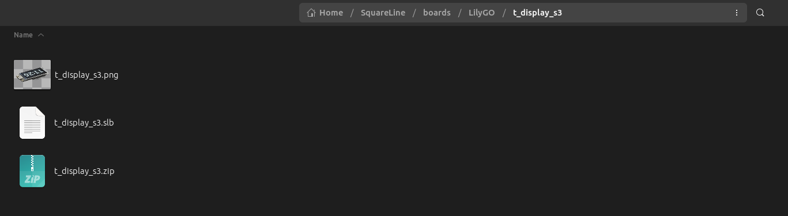
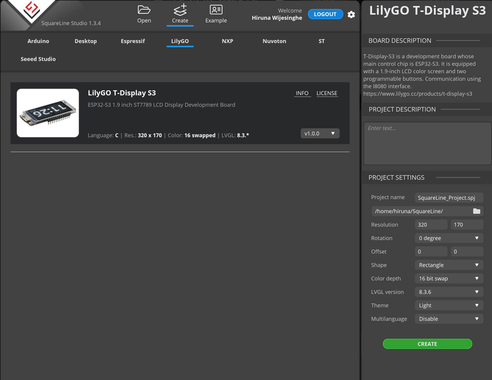
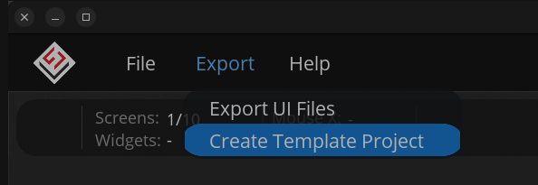
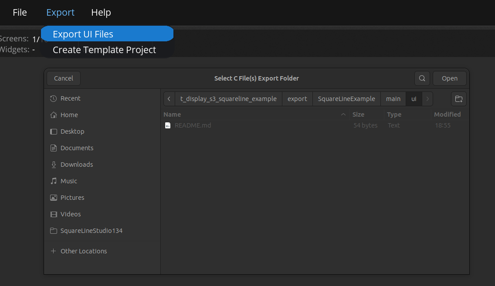

# esp-idf-t-display-s3

# Overview
This is a template ESP-IDF project for LilyGO [T-Display S3](https://github.com/Xinyuan-LilyGO/T-Display-S3).

This code follows a similar structure to the code provided in [esp-bsp](https://github.com/espressif/esp-bsp) repo.

For the previous version of the code (LVGL 8.3.x & IDF 5.3.x), click [here](https://github.com/hiruna/esp-idf-t-display-s3/tree/idf_5.3.x_lvgl_8.3.x).

## Tested Hardware & Software Framework(s)
* LilyGO T-Display S3 [v1.2] (non-touch)
  * ESP-IDF Version 5.5.x ([master branch](https://github.com/espressif/esp-idf))
  * LVGL 9.2.x

### Note on LVGL 9
LVGL demos were conflicting with the lvgl port task, see comments in `ui_lvgl_demos_task` func for my workaround.

## Capabilities

This project demonstrates the following capabilities:

* Configure the ST7789 display using the I80 Bus
  * Screen orientation is landscape where the buttons are facing towards the left
* Screen brightness control using [hiruna/esp-idf-aw9364](https://github.com/hiruna/esp-idf-aw9364.git)
  * 16-step brightness control
    * NOTE: according to the LilyGO [T-Display S3 Datasheet](https://github.com/Xinyuan-LilyGO/T-Display-S3/blob/main/schematic/T_Display_S3.pdf), the board is equipped with a [AW9364DNR Dimming LED Driver](https://datasheet.lcsc.com/lcsc/1912111437_AWINIC-Shanghai-Awinic-Tech-AW9364DNR_C401007.pdf)
      capable of 16-step brightness control.
* Battery voltage readout using ADC driver (oneshot)
  * Battery charge percentage (thanks to [this equation](https://electronics.stackexchange.com/a/551667))
    * I'm using a [3.7v 1150mAh Lithium battery](https://www.amazon.com.au/102540-Rechargeable-Motorcycles-Bluetooth-Replacement/dp/B09T3B1D1V?th=1)
      * Listing mentions Li-Po, battery says Li-ion
* Button readout using [espressif/button](https://components.espressif.com/components/espressif/button)
  * In the example, the buttons have been configured to change the display brightness (16-steps).

## sdkconfig

There are some sdkconfig options that needs to be set, I've included these in a [sdkconfig.defaults](./sdkconfig.defaults) file.
  * I haven't done anything fancy with the partition table, I'm simply using one of the default `PARTITION_TABLE_SINGLE_APP_LARGE`.
  * You can easily benchmark/stress test the display by setting `CONFIG_LV_USE_DEMO_BENCHMARK` (also requires `CONFIG_LV_USE_DEMO_WIDGETS`) or `CONFIG_LV_USE_DEMO_STRESS` options.
  * LVGL FPS/CPU Usage overlay can be disabled with `CONFIG_LV_USE_PERF_MONITOR=n`.

## Notes on LVGL and Memory Management

LVGL and display driver parameters have been set to utilize the SPI RAM. Performing a LVGL benchmark, I managed to get over 100 FPS.
According to the [ST7789 datasheet](https://www.rhydolabz.com/documents/33/ST7789.pdf), I think you should aim for 75 FPS.

## Notes on Display Framerate
Display framerate can be affected by many factors. During my testing I found that the `LVGL_BUFFER_SIZE` and `LCD_PIXEL_CLOCK_HZ` plays a key factor.

In my opinion, `LVGL_BUFFER_SIZE` should remain as is (1/10th of the display size in pixels) while the `LCD_PIXEL_CLOCK_HZ` can be tweaked.

The [ST7789 datasheet](https://www.rhydolabz.com/documents/33/ST7789.pdf) mentions a maximum pixel clock of 17 MHz `(17 * 1000 * 1000)`
but you may/may not experience issues with a high clock speed due to PSRAM banwidth (source: [ESP-FAQ Handbook](https://docs.espressif.com/projects/esp-faq/en/latest/esp-faq-en-master.pdf) [end of page 79]).

## SquareLine Studio

### Create a new board

1. Close the SquareLine Studio application if it is already running
2. Clone this repo
2. Navigate to [SquareLine](./SquareLine) directory
3. Create a compressed zip ofd the directory and name it `t_display_s3.zip`
    * Make sure recurse and symbolic links are followed
      * In Ubuntu, I used `zip -r t_display_s3.zip __ui_project_name__/`
4. Create a directory named `LilyGO` inside of SquareLine Studio installation's `boards` directory
5. Copy the [boards/t_display_s3](./SquareLine/boards/t_display_s3) directory into the `LilyGo` directory
   * Move the `t_display_s3.zip` created earlier into the `t_display_s3` directory
   
6. Open SquareLine Studio to see the T-Display-S3 board
   

### Create a new SquareLine Project

1. Create a new SquareLine Project using the board created previously
   * I used the default theme settings
2. Once the new project is opened, click on _**Export -> Create Template Project**_
   
3. Export the `ui` files by clicking on  _**Export -> Export UI Files**_.
   * Make sure to select the previously exported project's `main/ui` directory
   
4. Save the project